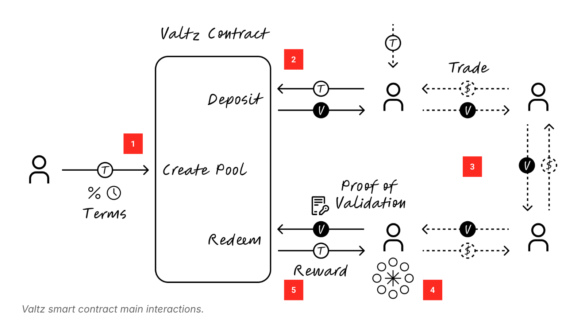

# 👯 Valtz

Valtz is a smart contract protocol for creation of validation futures, enabling blockchains to secure credible commitments from validators, enhancing security and driving growth from the testnet phase onwards.

## Deployments

| Contract            | Network | Address                                                                                                                       |
| ------------------- | ------- | ----------------------------------------------------------------------------------------------------------------------------- |
| Valtz               | Fuji    | [0x1b53093c2ad2649d048efc070ed13df6bd2b896a](https://testnet.snowtrace.io/address/0x1b53093c2ad2649d048efc070ed13df6bd2b896a) |
| `VLTZ-T` Test Token | Fuji    | [0xE23FB6cACd6A07B47D3d208844613D12b0C24856](https://testnet.snowtrace.io/address/0xE23FB6cACd6A07B47D3d208844613D12b0C24856) |

## 🌟 Introduction

Valtz protocol runs on Ethereum Virtual Machine (EVM) and offers a two-sided marketplace:

- **Blockchain teams** create a futures pool to reward validation commitments, thereby strengthening their chain's validator base and security in line with their growth.

- **Validators** commit future validation to blockchains by depositing validation tokens and submitting their current proof of validation. This process mints future validation tokens to receive rewards. Upon completing their validation and depositing their future validation tokens, validators claim boost rewards, which are on top of normal staking rewards, incentivizing their participation.

Similar to traditional commodity futures, Valtz validation futures are tradeable, enhancing security and growth of subnets while assessing the price of validation. Validators who join the pool early and later change their positions can sell their futures tokens to other validators who want to earn extra rewards from validation.

## ⚙️ System



The Valtz protocol operates as a smart contract, streamlining how chains and validators commit to long-term validation. Here's how it works:

1. A chain team creates a pool by depositing some of their staking tokens as rewards. They also define terms such as the required duration for validation, start and end times, and the reward rates for validators' commitments.

2. Users who hold the chain's native tokens—whether from an airdrop or the market—can deposit these tokens into the pool. In return, they mint a futures token for that chain.

3. Users can trade these futures tokens on the open market, which enables price discovery and hedging risks.

4. Those who validate the chain and hold their futures tokens can redeem their rewards.

5. Validators submit their proof of validation and burn their futures token, which unlocks both the original deposit and the earned rewards.

## 🔨 Codebase Overview

The Valtz protocol consists of two main contracts, as well as an offchain component:

1. `Valtz.sol`: The factory contract for creating pools
2. `ValtzPool.sol`: The individual pool contract
3. The Valtz backend fetches and signs proof of validation from validators. See [initial notes on the data sources](notes/avalanche-validation-data.md)

### Valtz.sol

The `Valtz` contract is responsible for creating new pools and includes the following main functions:

- **createPool**: Creates a new pool with the given configuration. This function is currently permissionless but will be removed in production.

  - `config`: A struct containing the pool configuration parameters

- **adminCreatePool**: Creates a new pool, restricted to accounts with the `POOL_CREATOR_ADMIN_ROLE`.

  - `config`: A struct containing the pool configuration parameters

- **subnetOwnerCreatePool**: Creates a new pool, intended to be restricted to subnet owners (implementation pending).
  - `config`: A struct containing the pool configuration parameters

### ValtzPool.sol

The `ValtzPool` contract represents an individual staking pool and includes the following main functions:

- **initialize**: Initializes the pool with the given configuration (called by the factory contract).

  - `config`: A struct containing the pool configuration parameters

- **deposit**: Allows users to deposit tokens into the pool.

  - `tokens`: The amount of tokens to deposit
  - `receiver`: The address to receive the minted receipt tokens

- **redeem**: Allows users to redeem their staked tokens and claim rewards.

  - `amount`: The amount of receipt tokens to redeem
  - `receiver`: The address to receive the withdrawn tokens and rewards
  - `valtzSignedData`: A bytes array containing validation data
  - `valtzSignature`: A bytes array containing the signature for authorization

- **start**: Starts the pool, allowing deposits and redemptions (only callable by the owner).

- **startAt**: Starts the pool at a specific timestamp (only callable by the owner).

  - `_startTime`: The timestamp to start the pool

- **rescue functions**: Allow the owner to rescue various token types (ERC20, ERC721, ERC1155) and native currency from the contract.

Key features of the `ValtzPool` contract:

- Uses OpenZeppelin's upgradeable contracts
- Implements ERC20 functionality for receipt tokens
- Includes a boost rate mechanism for rewards
- Tracks validator intervals to prevent double-redemption
- Implements role-based access control for certain functions
- Utilizes delegated authorization for redemptions

The contract also includes various view functions for calculating rewards, checking pool status, and retrieving validator intervals.

## Development

### Dependencies

- [Foundry](https://github.com/foundry-rs/foundry)
- [Just](https://github.com/casey/just)

### Build

```sh
just build
```

### Test

```sh
just test
```

### Watch Tests

```sh
just watch
```

### Local Anvil Deployment

Start Anvil:

```sh
just anvil
```

Deploy contracts locally:

```sh
# Deploy Valtz with signer
just deploy-valtz-local [valtz_signer_address]

# Deploy test token with optional recipient
just deploy-token-local [recipient_address]

# Full deployment sequence (Valtz + test token)
just deploy-local [valtz_signer_address] [recipient_address]
```

### Live Deploy

Deploy to Fuji testnet:

```sh
# Deploy Valtz with signer
PRIVATE_KEY=<your_key> just deploy-valtz-fuji <valtz_signer_address>

# Deploy test token
PRIVATE_KEY=<your_key> just deploy-token-fuji [token_name] [token_symbol]
```

### Generate ABIs

```sh
just generate-abi <contract_name>
```
